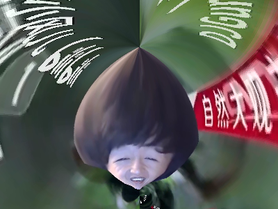

<div align=center>

# :wheelchair::wheelchair::wheelchair: Stereographic Projection of Otto :wheelchair::wheelchair::wheelchair:

```text
                                    :-=++*++=-.
                                  +@@@@@@@@@@@@%+:
                                =%**##@@@@@@@@@@@@%=
                             .=#+. :::-+*%@@@@@@@@@@#.
                           .+#-   .-#+=--=++++**#%@@@@=
                         .*#-    .::-+*===+**##%###%@@@+
                        +%=:::....::----:-*##*+==+**#%@@=
                      =%+.::---:::::::. .=*##*++=+++*#%@@:
                    :%+:.::-=======-:.  :=*###*+=====+*#@#
                   +%-.::-=+++++===.   .-=*####*+=--==+*#@:
                  *%::::-=++++=====-:....-+*####**+===++*@*
                 *%:::::-=++*+=---===-:::-+**###****+++++#@
                +#:::::-==+#%%%*=--======++*******#**++++*@-
               +%:.:::--==*@@%%%##*+===++++***#####**+==++@=
              *%:.:::--===*@@#++*%%%#*+++**###%%%%%*++==++%*
             +%...::--====*%@@=...-****#%%%@@@@@@@@*++==+*#%
            =@:...:--=====+#%@@+. .. :-::=--+=+%@@%*++==+**@:
           .@-...:--======+**%@@#=:  .      :=#@@@%*++==**#@+
           %=....:-======++**##%@@@#*+-::---*%@@@@%**++=**#@#
          *#....:-=======+*****#%@@@@@@@@@@@@@@@@@%***+=*##%@.
         +%.....:-=======+******%%@@@@@@@@@@%@@@@@%#**+=*##%@=
        -@.....:-------==+******##%%***###%%@@@@@@##**+=*#%%@*
       .@-.....::-----===++******#%%%%%%%%@@@@@@@%###*++*#%%@*
      .%+......:::---====++*******##%%%%%%%@@@@@@%###**+*#%%@*
      #*.......::---===+++++***********##%%@@@@%%####***##%%@-
     +%.......::----==+++++++******++***#%%%@%%######***#%%@%
    :@-......::----===++++++++++******##%%%%%########***#%%@:
    ##--------=====+++++++++**********##################%%@=
```

:hand::laughing:欧内的手，好汉，今天来点儿大家想看的东西。

这是一个用于得到球面上的 $otto$ 在平面上的球极投影的程序。

通过改变球的角度，可以得到不同的投影，从而验证 $otto$ 的 *“说的道理-栗子头二相性”* 。

</div>

## 目录

- [:wheelchair::wheelchair::wheelchair: Stereographic Projection of Otto :wheelchair::wheelchair::wheelchair:](#wheelchairwheelchairwheelchair-stereographic-projection-of-otto-wheelchairwheelchairwheelchair)
  - [目录](#目录)
  - [前言](#前言)
  - [“说的道理”与“栗子头”的诞生](#说的道理与栗子头的诞生)
    - [选取原始图像](#选取原始图像)
    - [将图片贴在球面上](#将图片贴在球面上)
    - [通过球极投影得到平面图像](#通过球极投影得到平面图像)
    - [变换球的角度得到不同的投影](#变换球的角度得到不同的投影)
  - [数学推导](#数学推导)
    - [计算投影平面上的点在球上的对应点坐标](#计算投影平面上的点在球上的对应点坐标)
    - [计算坐标系旋转后的坐标](#计算坐标系旋转后的坐标)
    - [计算对应原始图像的点的坐标](#计算对应原始图像的点的坐标)
  - [程序实现](#程序实现)
  - [测试用例](#测试用例)
    - [:laughing:说的道理](#laughing说的道理)
    - [:chestnut:栗子头](#chestnut栗子头)
  - [使用说明](#使用说明)
    - [下载 \& 解压](#下载--解压)
    - [配置 Python 环境](#配置-python-环境)
    - [安装依赖库](#安装依赖库)
    - [运行](#运行)
    - [参数说明](#参数说明)
  - [使用许可](#使用许可)

## 前言

> “球极投影是动物园的一次伟大实践与创新，是从欧透到说的道理与栗子头的必由之路，是动物园发展历程中的重大转折点，完成了鬼叫时代到道理时代的深刻变革。”

## “说的道理”与“栗子头”的诞生

在 DJGun 发布的视频 [《DJGun教你制作栗子头和说的道理》](https://www.bilibili.com/video/BV1624y1R7MU) 中，**说的道理**与**栗子头**的生成方法得到公开。

得到**说的道理**和**栗子头**的具体过程如下：

### 选取原始图像

原始图像来自 [@海绵宝宝小风儿](https://space.bilibili.com/180166708) 视频片头的古神语部分。

### 将图片贴在球面上

采用一般的球面投影方法得到球面上的 $otto$：

$$
\left\\{
    \begin{array}{l}
    x = r \cos{u} \sin{v} \\
    y = r \sin{u} \sin{v} \\
    z = r \cos{v}
    \end{array}
\right.
$$

<div align=center>


</div>

### 通过球极投影得到平面图像

首先是在二维情况下分析得到的球极投影的方法：

将圆心置于坐标系原点 $O(0,0)$，以圆与 $y$ 轴负半轴的交点 $D(0,-r)$ 为投影点，投影落在直线 $y=0$ 上。

取圆上一点 $P(x,y)$，与投影点连接得到直线 $PD$，其与 $y=0$ 的交点为 $Q(x',0)$，则 $Q$ 为 $P$ 在直线 $y=0$ 上的球极投影。

<div align=center>


</div>

那么拓展到三维可以得到：

将球心置于坐标系原点 $O(0,0,0)$，以球与 $z$ 轴负半轴的交点 $D(0,0,-r)$ 为投影点，投影落在平面 $z=0$ 上。

取球上一点 $P(x,y,z)$，与投影点连接得到直线 $PD$，其与 $z=0$ 的交点为 $Q(x',y',0)$，则 $Q$ 为 $P$ 在平面 $z=0$ 上的投影。

按照这一方法，得到球面上的 $otto$ 在平面 $z=0$ 上的球极投影：

<div align=center>


</div>

### 变换球的角度得到不同的投影

在上一步骤中，我们已经得到了**说的道理**，接下来通过变换球的角度得到**栗子头**。

<div align=center>


</div>

至此，已经得到了**说的道理**和**栗子头**，并验证了 $otto$ 的 *“说的道理-栗子头二相性”* 。

下面进行程序上的实现。

## 数学推导

在进行程序实现前，需要先经过数学推导，得到目标图像上点到原图像上点的映射关系。

在上面D老师的演示中，是正向去得到的，而在程序实现中，需要从目标投影图像上的点开始，去反向推算出在原图像上的点的位置。

### 计算投影平面上的点在球上的对应点坐标

如前文所述，将球心置于坐标系原点 $O(0,0,0)$，以球与 $z$ 轴负半轴的交点 $D(0,0,-r)$ 为投影点，投影落在平面 $z=0$ 上。

根据所设定的目标图像的尺寸，遍历每个像素点。设其中一点为 $Q(x',y',0)$，与投影点 $D(0,0,-r)$ 连接得到直线 $QD$，其与球的交点为 $P(x,y,z)$，则 $P$ 为 $Q$ 在球上的对应点。

<div align=center>


</div>

接下来计算点的坐标，为方便观察，在 $ODQ$ 所在平面上进行分析，以上几个点在平面上的关系如下图：

<div align=center>


</div>

所需要求的是 $P$ 点的坐标，数学推导如下：

> $求P点坐标，即向量 \vec{OP}：$
>
> $\vec{OP} = \vec{OD} + \vec{DP}$
>
> $已知有 \vec{OD} = (0,0,-r)，\vec{OQ} = (x',y',0)，|\vec{OD}| = |\vec{OP}| = r$
>
> $下面须求 \vec{DP}：$
>
> $\vec{DP} = |\vec{DP}| * \frac{\vec{DQ}}{|\vec{DQ}|}$
>
> $\vec{DQ} = \vec{OQ} - \vec{OD} = (x',y',0) - (0,0,-r) = (x',y',r)$
>
> $则 |\vec{DQ}| = \sqrt{x'^2 + y'^2 + r^2}$
>
> $在等腰 \triangle ODP 中，|\vec{DP}| = 2 r \cos{\theta}$
>
> $在 \triangle ODQ中，\cos{\theta} = \frac{|\vec{OD}|}{|\vec{DQ}|} = \frac{r}{\sqrt{x'^2 + y'^2 + r^2}}$
>
> $|\vec{DP}| = 2 r \frac{r}{\sqrt{x'^2 + y'^2 + r^2}} = \frac{2r^2}{\sqrt{x'^2 + y'^2 + r^2}}$
>
> $得到 \vec{DP} = \frac{2r^2}{\sqrt{x'^2 + y'^2 + r^2}}* \frac{(x',y',r)}{\sqrt{x'^2 + y'^2 + r^2}} = \frac{2r^2}{x'^2 + y'^2 + r^2} (x',y',r)$
>
> $令 k = \frac{2r^2}{x'^2 + y'^2 + r^2}$
>
> $综上，P = \vec{OP} = (0,0,-r) + k (x',y',r) = (kx',ky',(k-1)r)$

至此，得到了目标投影图像上的点 $Q$ 在球上的对应点 $P$ 的坐标。

### 计算坐标系旋转后的坐标

<div align=center>


</div>

这里为便于计算把前面所述球的旋转转换为坐标系的旋转，设某点 $P(x,y,z)$ 变换后的坐标为 $P'(x',y',z')$，有以下结论：

**绕 $x$ 轴旋转 $\alpha$ 角度：**

$$
\left\\{
    \begin{array}{l}
    x' = x \\
    y' = y \cos{\alpha} - z \sin{\alpha} \\
    z' = y \sin{\alpha} + z \cos{\alpha}
    \end{array}
\right.
$$

可用矩阵表示为：

$$
\left[
    \begin{array}{l}
    x' \\
    y' \\
    z'
    \end{array}
\right] =
\left[
    \begin{array}{ccc}
    1 & 0 & 0 \\
    0 & \cos{\alpha} & -\sin{\alpha} \\
    0 & \sin{\alpha} & \cos{\alpha}
    \end{array}
\right]
\left[
    \begin{array}{l}
    x \\
    y \\
    z
    \end{array}
\right]
$$

**绕 $y$ 轴旋转 $\beta$ 角度：**

$$
\left\\{
    \begin{array}{l}
    x' = x \cos{\beta} + z \sin{\beta} \\
    y' = y \\
    z' = -x \sin{\beta} + z \cos{\beta}
    \end{array}
\right.
$$

可用矩阵表示为：

$$
\left[
    \begin{array}{l}
    x' \\
    y' \\
    z'
    \end{array}
\right] =
\left[
    \begin{array}{ccc}
    \cos{\beta} & 0 & \sin{\beta} \\
    0 & 1 & 0 \\
    -\sin{\beta} & 0 & \cos{\beta}
    \end{array}
\right]
\left[
    \begin{array}{l}
    x \\
    y \\
    z
    \end{array}
\right]
$$

**绕 $z$ 轴旋转 $\gamma$ 角度：**

$$
\left\\{
    \begin{array}{l}
    x' = x \cos{\gamma} - y \sin{\gamma} \\
    y' = x \sin{\gamma} + y \cos{\gamma} \\
    z' = z
    \end{array}
\right.
$$

可用矩阵表示为：

$$
\left[
    \begin{array}{l}
    x' \\
    y' \\
    z'
    \end{array}
\right] =
\left[
    \begin{array}{ccc}
    \cos{\gamma} & -\sin{\gamma} & 0 \\
    \sin{\gamma} & \cos{\gamma} & 0 \\
    0 & 0 & 1
    \end{array}
\right]
\left[
    \begin{array}{l}
    x \\
    y \\
    z
    \end{array}
\right]
$$

那么，根据矩阵乘法的结合律，可以得到，经过变换后的坐标为：

$$
\left[
    \begin{array}{l}
    x' \\
    y' \\
    z'
    \end{array}
\right] =
\left[
    \begin{array}{ccc}
    \cos{\gamma}\cos{\beta} \
    & \cos{\gamma}\sin{\beta}\sin{\alpha} \
    - \sin{\gamma}\cos{\alpha} \
    & \cos{\gamma}\sin{\beta}\cos{\alpha} \
    + \sin{\gamma}\sin{\alpha}
    \\
    \sin{\gamma}\cos{\beta} \
    & \sin{\gamma}\sin{\beta}\sin{\alpha} \
    + \cos{\gamma}\cos{\alpha} \
    & \sin{\gamma}\sin{\beta}\cos{\alpha} \
    - \cos{\gamma}\sin{\alpha}
    \\
    -\sin{\beta} \
    & \cos{\beta}\sin{\alpha} \
    & \cos{\beta}\cos{\alpha}
    \end{array}
\right]
\left[
    \begin{array}{l}
    x \\
    y \\
    z
    \end{array}
\right]
$$

### 计算对应原始图像的点的坐标

根据球面投影的坐标变换公式：

$$
\left\\{
    \begin{array}{l}
    x = r \cos{u} \sin{v} \\
    y = r \sin{u} \sin{v} \\
    z = r \cos{v}
    \end{array}
\right.
$$

写出逆变换公式：

$$
\left\\{
    \begin{array}{l}
    u = \arctan{\frac{y}{x}} \\
    v = \arccos{\frac{z}{r}}
    \end{array}
\right.
$$

这里 $u$ 和 $v$ 的值域分别为 $[0, 2\pi)$ 和 $[0, \pi]$，需要再根据原始图像的尺寸大小，将 $u$ 和 $v$ 的值域映射到 $[0, w)$ 和 $[0, h)$：

$$
\left\\{
    \begin{array}{l}
    u' = \frac{u}{2\pi} w \\
    v' = \frac{v}{\pi} h
    \end{array}
\right.
$$

转为整形并做边界检查。

至此，已经完成了从投影图像像素点到原始图像像素点的映射的推导。

## 程序实现

[main.py](./main.py)

## 测试用例

### :laughing:说的道理

参数：

- 原始图像：[otto.png](./otto.png)
- 图像尺寸：400 * 300
- 垂直方向偏移量：0.4
- 缩放倍数：1.5
- 旋转角度： $\alpha = \gamma = 0 \degree$， $\beta = -5 \degree$


### :chestnut:栗子头

参数：

- 原始图像：[otto.png](./otto.png)
- 图像尺寸：400 * 300
- 垂直方向偏移量：-0.4
- 缩放倍数：1
- 旋转角度： $\alpha = \gamma = 0 \degree$， $\beta = 155 \degree$



## 使用说明

本项目使用 Python 编写，依赖 numpy 库进行主要的数学运算。

### 下载 & 解压

点击右上方的绿色 ```Code``` 按钮，在下拉菜单中点击 ```Download ZIP```
下载完成后，把它解压到你想要的位置。

### 配置 Python 环境

略。

### 安装依赖库

```bash
pip install numpy
```

### 运行

编辑 ```main.py``` 文件，按需修改开头部分的相关参数。

参数调整完成后，编译运行，在所设定的输出路径下找到生成的投影图像。

### 参数说明

**1. 路径（相对、绝对路径均可）**

```path_img```：原始图像

```path_proj```：输出的投影图像

**2. 输出的投影图像尺寸（像素）**

```w_proj```：宽

```h_proj```：高

**3. 偏移量（百分比）**

```offset_hor```：水平方向（向右为正）

```offset_ver```：垂直方向（向下为正）

输出的投影图像相当于在整个投影平面下取了一个矩形区域，以上两个参数就是调整该矩形在投影平面的位置。

均为 0 时，输出的图像中心与坐标轴原点重合；例如当两个偏移量均为 $\frac{1}{4}$ 时，投影图像范围变换如下图白框所示：

<div align=center>


</div>

**4. 缩放倍数**

```scale```：缩放倍数

这里的缩放倍数实际是调整球的半径，在前面的数学推导中可以看到，对于相同尺寸的投影区域，球的半径越大，输出图像中包含的内容越少，相当于放大了图像；相反地，球的半径越小，则相当于缩小了图像。

**5. 旋转角度（度）**

```alpha```：绕 $x$ 轴旋转

```beta```：绕 $y$ 轴旋转

```gamma```：绕 $z$ 轴旋转

是通过坐标系的旋转等效为球上贴图的旋转来实现的，从而得到 $otto$ 的不同形态。

坐标系的旋转除我在前文的推导外，也可以参考 “欧拉角-四元数的转换” ，不再赘述。


## 使用许可

[MIT © Gol3vka.](./LICENSE)
